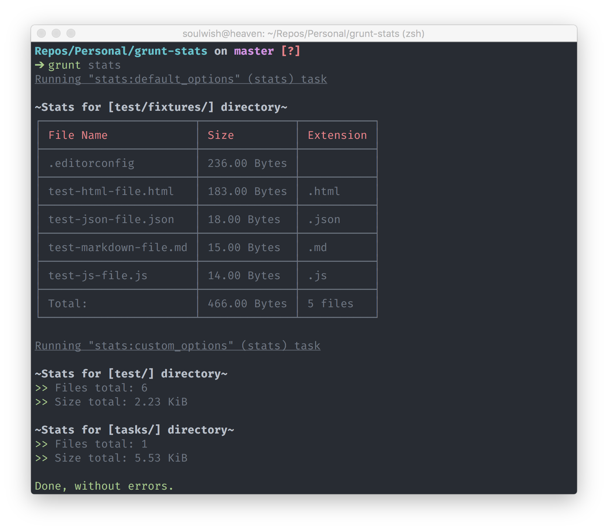

# grunt-stats [](https://travis-ci.org/soul-wish/grunt-stats)

> Display files statistic for separate directories in your project.



## Getting Started
This plugin requires Grunt `~0.4.5`

If you haven't used [Grunt](http://gruntjs.com/) before, be sure to check out the [Getting Started](http://gruntjs.com/getting-started) guide, as it explains how to create a [Gruntfile](http://gruntjs.com/sample-gruntfile) as well as install and use Grunt plugins. Once you're familiar with that process, you may install this plugin with this command:

```shell
npm install grunt-stats --save-dev
```

Once the plugin has been installed, it may be enabled inside your Gruntfile with this line of JavaScript:

```js
grunt.loadNpmTasks('grunt-stats');
```

## The "stats" task

### Overview
In your project's Gruntfile, add a section named `stats` to the data object passed into `grunt.initConfig()`.

```js
grunt.initConfig({
  stats: {
    options: {
      // Task-specific options go here.
    },
    your_target: {
      // Target-specific file lists and/or options go here.
    },
  },
});
```

### Options

#### options.mode
Choices: `'verbose'`, `'short'`  
Default: `'short'`

Either display only short statistic for directory (amount of files and overall size) or display full report in a table format (list of all files, sorted by file size).

### Usage Examples

In this example, the default options are used to display short statistic for `app/js/` directory. And the custom options are used to display full statistic for `app/` and `assets/` directories separately.

```js
grunt.initConfig({
    stats: {
        default_options: ['app/js/'],
        custom_options: {
            options: {
                mode: 'verbose'
            },
            src: ['app/', 'assets/']
        }
    },
});
```

## License

MIT © [Sergey Lysenko](http://soulwish.info)
